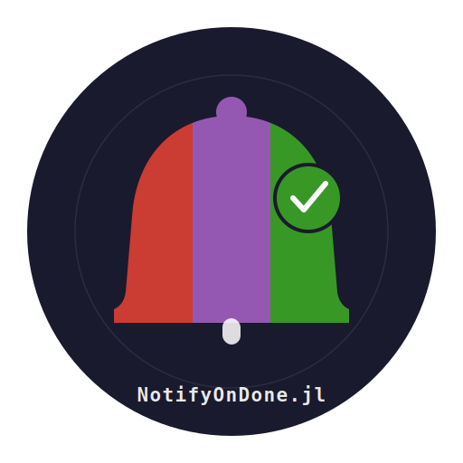

<p align="center">
  
</p>

# NotifyOnDone.jl

Juliaの長時間計算が終わったら（またはエラーになったら）Slackに通知する `@notify` マクロです。

## インストール

```julia
using Pkg
Pkg.add(url="https://github.com/Chihiro-g/NotifyOnDone.jl")
```

## セットアップ

[Slack API](https://api.slack.com/apps) でアプリを作成し、Incoming Webhookを有効化してURLを取得してください。

Webhook URLの設定方法は2つあり、**`set_webhook!` が優先**されます。

### 方法1: startup.jl に書く（ローカル環境で毎回設定不要にする場合）

`~/.julia/config/startup.jl` に書いておくと、Julia起動時に自動で読み込まれます。VSCodeのShift+Enterでの実行でも有効です。

```bash
mkdir -p ~/.julia/config
touch ~/.julia/config/startup.jl
```

`~/.julia/config/startup.jl` に以下を追記：

```julia
ENV["SLACK_WEBHOOK_URL"] = "https://hooks.slack.com/services/XXX/YYY/ZZZ"
```

設定できているか確認するには、JuliaのREPLで以下を実行します：

```julia
ENV["SLACK_WEBHOOK_URL"]  # URLが表示されればOK
```

### 方法2: スクリプト内で設定（共有アカウントで複数人が使う場合）

```julia
using NotifyOnDone
set_webhook!("https://hooks.slack.com/services/XXX/YYY/ZZZ")
```

URLをスクリプトに直書きする場合は、そのスクリプトを `.gitignore` に追加してGitに含めないようにしてください。URLだけ別ファイルに分離する方法もあります：

```julia
# my_webhook.jl（.gitignoreに追加）
set_webhook!("https://hooks.slack.com/services/自分のURL")
```

```julia
# 計算スクリプト本体（Gitに上げてOK）
using NotifyOnDone
include("my_webhook.jl")
@notify "計算" my_func()
```

## 使い方

```julia
using NotifyOnDone

# 共有サーバーで自分のURLを設定（個人アカウントなら不要）
set_webhook!("https://hooks.slack.com/services/自分のURL")

# シンプルな使い方
@notify heavy_simulation(params, n=100_000)

# ラベルを付ける（通知に名前が出て分かりやすい）
@notify "モデル学習" train!(model, X, y)

# begin...end ブロックで複数処理をまとめる
@notify "前処理 + 学習" begin
    X, y  = preprocess(raw_data)
    model = train!(MyModel(), X, y)
end
```

## 通知の内容

**成功時**
```
✅ 計算完了
ラベル:   モデル学習
経過時間: 1時間 23分 7.4秒
ホスト:   myserver.local
完了時刻: 2025-03-01T14:32:07
```

**エラー時**
```
❌ エラーが発生しました
ラベル:   モデル学習
経過時間: 4分 12.3秒
ホスト:   myserver.local
発生時刻: 2025-03-01T14:32:07
エラー内容: DimensionMismatch("matrix A has dimensions ...")
```

エラー時は通知後に例外を再スローするため、JuliaのREPLにも通常通りスタックトレースが表示されます。

## 動作要件

- Julia 1.6 以上
- `curl` コマンド（標準的なLinux/macOS環境であれば利用可能）
- Slack Incoming Webhook URL

`curl` が使えない環境では、`src/NotifyOnDone.jl` 内の `_send_slack` 関数を `HTTP.jl` を使う実装に差し替えてください：

```julia
using HTTP
function NotifyOnDone._send_slack(payload_json::String)
    url = NotifyOnDone._webhook_url()
    try
        r = HTTP.post(url, ["Content-Type" => "application/json"], payload_json;
                      status_exception=false)
        r.status == 200 || @warn "Slack通知失敗 (HTTP $(r.status))"
    catch e
        @warn "Slack通知エラー: $e"
    end
end
```

## セキュリティ

- Webhook URLは環境変数で管理し、コードやGitリポジトリに含めない
- `https://hooks.slack.com/` 以外のURLは警告を出す
- Slack送信が失敗しても `@warn` に留め、計算本体の例外には影響しない
